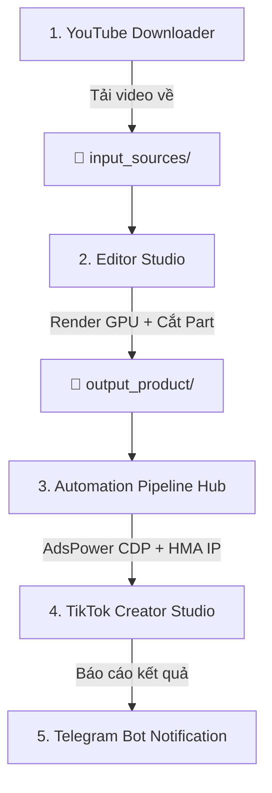

# 🎬 TikTok Studio Pro — All-in-One Video Automation & Multi-Account Publishing Platform

[](https://www.python.org/downloads/)
[](https://microsoft.com/windows)
[](LICENSE)
[]()

> **TikTok Studio Pro** là nền tảng tự động hóa toàn diện dành cho các nhà sáng tạo nội dung và nhà phát triển kênh TikTok/YouTube: Tự động quét & tải video nguồn từ YouTube, phân tích và biên tập đồ họa (canvas 3:4 / 9:16, mờ nền, gắn banner tiêu đề), cắt part siêu tốc bằng GPU hardware acceleration, và tự động đăng bài hàng loạt qua AdsPower Multi-Profile Browser + HMA VPN + n8n webhook + Telegram Bot.

---

## 🌟 Tính Năng Nổi Bật (Key Features)

### 1. 📥 YouTube Video & Shorts Downloader (Siêu Tốc)
- **Quét Kênh Tức Thì (0.5s - 1.0s)**: Tự động phát hiện toàn bộ video dài, Shorts, lượt view, thời lượng từ kênh YouTube mà không cần cookies.
- **Tải Xuống Hàng Loạt**: Hỗ trợ hàng đợi tải xuống ngầm mượt mà, tự động phân loại vào thư mục tên kênh tương ứng (`input_sources/<Tên_Kênh>/`).

### 2. ✂️ Smart Video Engine & Splitter (Chuẩn Gốc & Siêu Tốc)
- **Tỉ Lệ Đa Dạng**: Hỗ trợ chuẩn TikTok/Reels `3:4` và `9:16`.
- **Hiệu Ứng Chống Quét Bản Quyền**:
  - Double-Layer Background Blur (Mờ nền 2 lớp giữ chủ thể trung tâm sắc nét).
  - Horizontal Flip (Lật ngang khung hình).
  - Color & Contrast Boost (Tăng độ tương phản và tươi màu).
- **Banner Tiêu Đề Tự Động**: Hỗ trợ các phong cách tiêu đề hiện đại: Rounded White Box, Dark Glassmorphism, Pill Badge hoặc Shadow Text.
- **Quy Chuẩn Cắt Video Chuẩn Gốc (Default Rules)**:
  - **Video ngắn ($\le$ 60s / Shorts)**: Biên tập và xuất trọn vẹn 1 clip hoàn chỉnh (`... - part 1.mp4`).
  - **Video dài ($<$ 12 phút)**: Chia đều **3 phần trọn vẹn** (`Part 1`, `Part 2`, `Part 3`) bao trọn 100% cốt truyện.
  - **Video dài ($\ge$ 12 phút)**: Chia đều **6 phần trọn vẹn** (`Part 1` đến `Part 6`).
  - **Tốc Độ 0.1s**: Cắt các part bằng cơ chế Stream Copy (`-c copy`) không làm giảm chất lượng gốc.
- **Tăng Tốc Phần Cứng (Hardware Acceleration)**: Tự động phát hiện và kích hoạt GPU NVIDIA NVENC / AMD AMF / Intel QSV / CPU Multi-core.

### 3. 🚀 AdsPower & TikTok Studio Auto-Uploader
- **Đăng Bài Đa Luồng Tự Động**: Điều khiển AdsPower Browser qua Chrome DevTools Protocol (CDP) trực tiếp vào `tiktok.com/creator-center/upload`.
- **Tự Động Điền Tiêu Đề & Hashtag**: Tạo caption thông minh kết hợp hashtag xu hướng hoặc tự động tạo qua Google Gemini AI.
- **Multi-Tab Staggered Upload**: Nạp đồng thời nhiều tab với cơ chế so le chống nghẽn đường truyền.
- **Tự Động Đổi IP HMA VPN**: Tự động chuyển đổi IP theo quốc gia tương ứng với từng tài khoản TikTok trước khi mở trình duyệt.

### 4. 🤖 n8n Workflow Integration & Lập Lịch Tự Động
- Tích hợp sẵn template workflow n8n để kích hoạt đăng bài tự động theo lịch hẹn giờ hàng ngày hoặc ban đêm.
- RESTful API đầy đủ cho toàn bộ quy trình: Quét kênh, tải video, render hàng loạt, kiểm tra ma trận tài khoản và phân phối clip.

### 5. 📢 Thông Báo Telegram Thời Gian Thực
- Tự động gửi thông báo trực tiếp về Telegram Bot / Telegram Group mỗi khi hoàn tất batch render hoặc sau mỗi lượt đăng bài thành công lên TikTok.

---

## 📂 Cấu Trúc Dự Án (Repository Structure)

```text
tiktok-studio-pro/
├── 📁 assets/                 # Tài nguyên đồ họa, font chữ (.ttf) và template banner
│   └── 📁 fonts/              # Chứa Poppins-Bold.ttf, Montserrat-Bold.ttf...
├── 📁 bin/                    # Chứa ffmpeg.exe & ffprobe.exe (tùy chọn)
├── 📁 data/                   # Dữ liệu cấu hình (được bảo vệ bởi .gitignore)
│   ├── 📄 accounts.example.json  # Mẫu danh sách kênh YouTube & tài khoản TikTok
│   └── 📄 settings.example.json  # Mẫu cấu hình AdsPower, Gemini, Telegram, HMA
├── 📁 docs/                   # Tài liệu hướng dẫn sử dụng chi tiết
├── 📁 n8n/                    # File mẫu Workflow n8n tích hợp
│   ├── 📄 n8n_workflow_tiktok_studio.json
│   └── 📄 n8n_workflow_nightly_scheduler.json
├── 📁 src/                    # Mã nguồn Core & Services
│   ├── 📁 core/               # Quản lý cấu hình & asset
│   └── 📁 services/           # YouTube Downloader, Video Engine, TikTok Uploader, Gemini...
├── 📁 ui/                     # Giao diện Webapp (HTML5, CSS3, JavaScript ES6)
├── 📄 config.py               # Quản lý đường dẫn môi trường
├── 📄 server.py               # Máy chủ Web Server Dual-Stack (IPv4 & IPv6)
├── 📄 requirements.txt        # Danh sách thư viện Python
├── 📄 Install_Dependencies.bat# Script cài đặt môi trường 1-Click
├── 📄 Open_Studio.bat         # 1-Click mở Studio (dạng cửa sổ)
├── 📄 Open_Studio.vbs         # 1-Click mở Studio (chạy ngầm hoàn toàn)
├── 📄 Stop_Studio.bat         # 1-Click dừng toàn bộ máy chủ và tác vụ ngầm
└── 📄 README.md               # Tài liệu dự án
```

---

## 🚀 Hướng Dẫn Cài Đặt & Sử Dụng (Quick Start)

### 1. Yêu cầu hệ thống
- Hệ điều hành: **Windows 10 / 11 (64-bit)**
- **Python 3.8+** ([Tải Python chính thức](https://www.python.org/downloads/))  
  *(⚠️ **Lưu ý quan trọng:** Khi cài đặt Python, nhớ tích chọn ô **"Add python.exe to PATH"**)*.

---

### 2. Cài đặt 1-Click (Chỉ làm 1 lần đầu)
1. Tải toàn bộ mã nguồn về máy hoặc dùng lệnh `git`:
   ```bash
   git clone https://github.com/your-username/tiktok-studio-pro.git
   cd tiktok-studio-pro
   ```
2. Nhấp đúp chuột vào file **`Install_Dependencies.bat`**.  
   *Script sẽ tự động cài đặt thư viện cần thiết, thiết lập cấu trúc thư mục mẫu và tạo sẵn Shortcut 1-Click trên Desktop của bạn!*

---

### 3. Khởi động ứng dụng
- **Cách 1 (Nhanh nhất)**: Nhấp đúp vào biểu tượng **`TikTok Studio Pro`** trên màn hình Desktop hoặc trong thư mục dự án.
- **Cách 2**: Nhấp đúp file **`Open_Studio.bat`** (hoặc `Open_Studio.vbs`).
- Trình duyệt sẽ tự động mở giao diện quản trị tại: **`http://localhost:8000`**.

---

## 📖 Hướng Dẫn Vận Hành (Workflow)



1. **Bước 1 — Tải Video Nguồn**:
   - Vào tab **YouTube Downloader (0.15)** ➔ Chọn kênh ➔ Chọn các video muốn tải ➔ Bấm **"Bắt đầu tải"**.
2. **Bước 2 — Biên tập & Cắt Part**:
   - Vào tab **Editor Studio** ➔ Chọn video ➔ Chọn tỉ lệ (`3:4` hoặc `9:16`), kiểu banner tiêu đề ➔ Chế độ cắt: **Auto (Chuẩn gốc)** ➔ Bấm **"Start Batch Process"**.
3. **Bước 3 — Quản lý & Đăng bài**:
   - Theo dõi tiến trình trực tiếp tại khung **Real-time Processing Console**.
   - Video thành phẩm được lưu tại `output_product/<Tên_Kênh>/` và hiển thị trong **Finished Library**.
   - Hệ thống tự động phân bổ clip cho 22 tài khoản TikTok trong tab **Automation Pipeline** và đăng bài tự động!

---

## ⚙️ Cấu Hình API & Dịch Vụ Mở Rộng

Mở tab **Settings** trên Webapp (hoặc chỉnh sửa file `data/settings.json`) để cấu hình các tính năng nâng cao:
* **AdsPower API**: URL kết nối AdsPower Local API (mặc định `http://local.adspower.net:50325`).
* **HMA VPN**: Đường dẫn file thực thi `Vpn.exe` để tự động đổi IP theo quốc gia.
* **Google Gemini AI**: Nhập API Key miễn phí từ Google AI Studio để tự động dịch thuật và tạo caption viral.
* **Telegram Bot**: Nhập `bot_token` và `chat_id` (hỗ trợ cả Chat cá nhân và Group ID `-100...`) để nhận thông báo tức thì.

---

## 🚀 Triển Khai Máy Chủ & Cloud Deployment

TikTok Studio Pro hỗ trợ đầy đủ các hình thức đóng gói & triển khai cho môi trường Server / VPS / Cloud:

### 1. Triển khai bằng Docker Compose (Khuyên dùng)
```bash
git clone https://github.com/denishoang0205/video_edit_studio.git
cd video_edit_studio
docker compose up -d --build
```

### 2. Triển khai 1-Click trên Linux VPS (Ubuntu / Debian)
```bash
chmod +x deploy.sh
./deploy.sh
```

👉 Chi tiết hướng dẫn cấu hình Nginx Reverse Proxy, SSL HTTPS và Systemd Service: xem tại [docs/HUONG_DAN_DEPLOY.md](docs/HUONG_DAN_DEPLOY.md).

---

## 🛡️ Bảo Mật & Đóng Gói Lên GitHub

* Dự án đã được thiết lập sẵn file **`.gitignore`** và **`.dockerignore`** tiêu chuẩn:
  * Toàn bộ dữ liệu nhạy cảm (tài khoản cá nhân `accounts.json`, khóa API `settings.json`, cookies và video tải về) **sẽ không bao giờ bị lộ hoặc vô tình commit lên Git / Docker image**.
  * File mẫu `data/accounts.example.json` và `data/settings.example.json` được cung cấp sẵn để người dùng mới có thể chạy ngay sau khi clone.

---

## 📜 Giấy Phép (License)
Dự án được phát hành theo giấy phép mã nguồn mở **MIT License**. Tự do sử dụng, tùy biến và chia sẻ cho cộng đồng.

